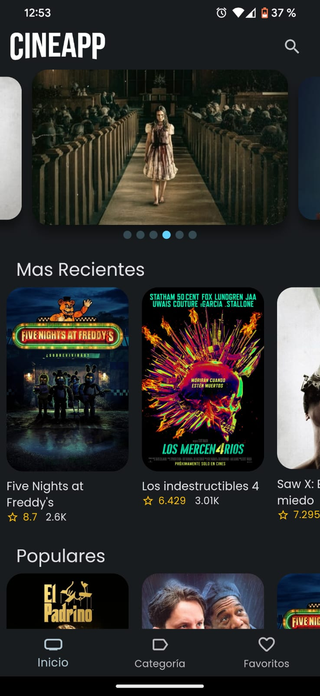
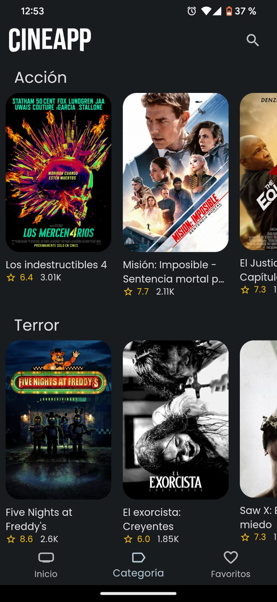
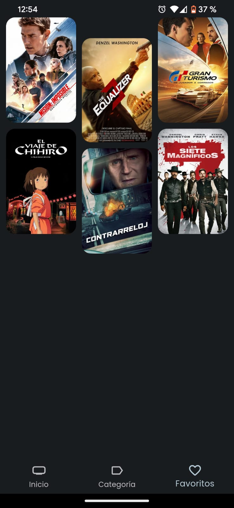

# Cinemaapp


Esta es una aplicación móvil desarrollada en Flutter que te permite explorar películas, obtener detalles sobre películas específicas, buscar por títulos y descubrir información relevante sobre las mismas gracias a la API de The Movie Database (TMDb).

## Características
- Explorar Películas: Visualiza una lista de películas populares, en estreno y mejor valoradas.
- Detalles de Películas: Accede a información detallada sobre cada película, incluyendo sinopsis, elenco, valoraciones, y más.
- Buscar Películas: Busca películas por título para encontrar información específica.
- Favoritos: Marca tus películas favoritas y accede a ellas fácilmente.
- Gestor de Estado Riverpod: Utilizamos Riverpod para el manejo eficiente del estado en toda la aplicación.


## Tecnologías Utilizadas
- Flutter: Framework de desarrollo multiplataforma.
- Riverpod: Gestor de estado en Flutter.
- API de The Movie Database (TMDb): Para obtener información sobre películas.


## Instalación

1. Clona el repositorio desde [URL del repositorio].

2. Abre el proyecto en tu editor de código favorito 

3. Ejecuta `flutter pub` get para instalar las dependencias.

4. Obtén una API Key de The Movie Database (TMDb) Enlace para obtener una API Key.

5. Crea un archivo `.env` y agrega tu API Key:

```bash
  apiKey = 'TU_API_KEY'

```
6. Ejecuta la aplicación en un emulador o dispositivo con el comando `flutter run.`

## Capturas de Pantalla






## Créditos
Esta aplicación utiliza datos de The Movie Database (TMDb). Agradecemos su servicio y la información proporcionada.


>>>>>>> official-go-router

# Dev

Cambiar las variables de entorno en https://www.themoviedb.org/
